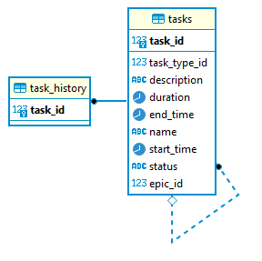

# Проект Task Manager

Технологии: Java 18, Spring Boot 3.4.5, Hibernate, PostgreSQL, Lombok, Maven, Docker

---

## Описание

Трекер задач, позволяющий эффективно организовать совместную работу над задачами. При выполнении масштабной
задачи, её можно разбить на подзадачи. Дает возможность добавлять, обновлять, удалять и получать задачи, в том числе в
порядке приоритета. Также трекер отображает последние просмотренные пользователем задачи. У каждой задачи есть:

* Название
* Описание
* Статус выполнения
* Продолжительность (в часах и минутах)
* Время начала выполнения задачи (с датой)
* Время окончания выполнения задачи (с датой)

Чтобы создать подзадачу, сначала нужно создать масштабную задачу (EpicTask). У масштабной задачи статус,
продолжительность, время начала выполнения и время окончания выполнения рассчитываются на основе её подзадач.

---

## Endpoints

### Task

| Метод  | Путь                 | Описание                      |
|--------|----------------------|-------------------------------|
| POST   | /tasks/task          | Добавление задачи             | 
| PATCH  | /tasks/task/{taskId} | Обновление задачи             | 
| DELETE | /tasks/task/{taskId} | Удаление задачи по ID         | 
| DELETE | /tasks/task          | Удаление всех задач           | 
| GET    | /tasks/task/{taskId} | Получение задачи по ID        | 
| GET    | /tasks/task          | Получение всех задач          | 
| GET    | /tasks/history       | Получение истории задач       | 
| GET    | /tasks               | Получение задач по приоритету |

<details>
<summary>Пример тела запроса</summary>

```
{
    "name" : "string (required)",
    "description": "string",
    "status" : "string (required, possible statuses: NEW, IN_PROGRESS, DONE)",
    "duration": "string (format HH:mm)",
    "startTime": "string (format yyyy-MM-dd HH:mm)"
}
```

</details>

### SubTask

| Метод  | Путь                       | Описание                  |
|--------|----------------------------|---------------------------|
| POST   | /tasks/subtask             | Добавление подзадачи      | 
| PATCH  | /tasks/subtask/{subtaskId} | Обновление подзадачи      | 
| DELETE | /tasks/subtask/{subtaskId} | Удаление подзадачи по ID  | 
| DELETE | /tasks/subtask             | Удаление всех подзадач    | 
| GET    | /tasks/subtask/{subtaskId} | Получение подзадачи по ID | 
| GET    | /tasks/subtask             | Получение всех подзадач   |

<details>
<summary>Пример тела запроса</summary>

```
{
    "name" : "string (required)",
    "description": "string",
    "status" : "string (required, possible statuses: NEW, IN_PROGRESS, DONE)",
    "duration": "string (format HH:mm)",
    "startTime": "string (format yyyy-MM-dd HH:mm)"
    "epicTaskId" : "number (required)"
}
```

</details>

### EpicTask

| Метод  | Путь                          | Описание                 |
|--------|-------------------------------|--------------------------|
| POST   | /tasks/epic                   | Добавление эпика         | 
| PATCH  | /tasks/epic/{epicId}          | Обновление эпика         | 
| DELETE | /tasks/epic/{epicId}          | Удаление эпика по ID     | 
| DELETE | /tasks/epic                   | Удаление всех эпиков     | 
| GET    | /tasks/epic/{epicId}          | Получение эпика по ID    | 
| GET    | /tasks/epic                   | Получение всех эпиков    |
| GET    | /tasks/epic/{epicId}/subtasks | Получение подзадач эпика |

<details>
<summary>Пример тела запроса</summary>

```
{
    "name" : "string (required)",
    "description": "string",
    "status" : "string (required, possible statuses: NEW, IN_PROGRESS, DONE)",
}
```

</details>

---

## Модель базы данных

(InheritanceType.SINGLE_TABLE)



---

## Запуск приложения

Необходимые инструменты:

* [Java (JDK) 18](https://github.com/corretto/corretto-18/releases)
* [PostgreSQL 15](https://www.enterprisedb.com/downloads/postgres-postgresql-downloads)

Создайте БД в PostgreSQL.
Настройте подключение к БД (через application.properties). Укажите:

- `spring.datasource.url`
- `spring.datasource.username`
- `spring.datasource.password`

---

### С помощью командной строки

Находясь в корневой папке проекта, выполнить:

Linux/macOS:

* ./mvnw package

Windows:

* mvnw.cmd package

После успешной сборки:

* java -jar target/task-manager-1.0.jar

---

### С помощью среды разработки (IntelliJ IDEA, Eclipse, NetBeans)

* Найдите `TaskManagerApp` в src/main/java/task/manager/app
* Нажмите ▶️ рядом с классом (или Shift+F10 в IntelliJ IDEA)

---

### С помощью Docker

Необходимые инструменты:

* [Docker](https://www.docker.com/)

Находясь в корневой папке проекта, запустить Docker и выполнить:

* docker compose up --build